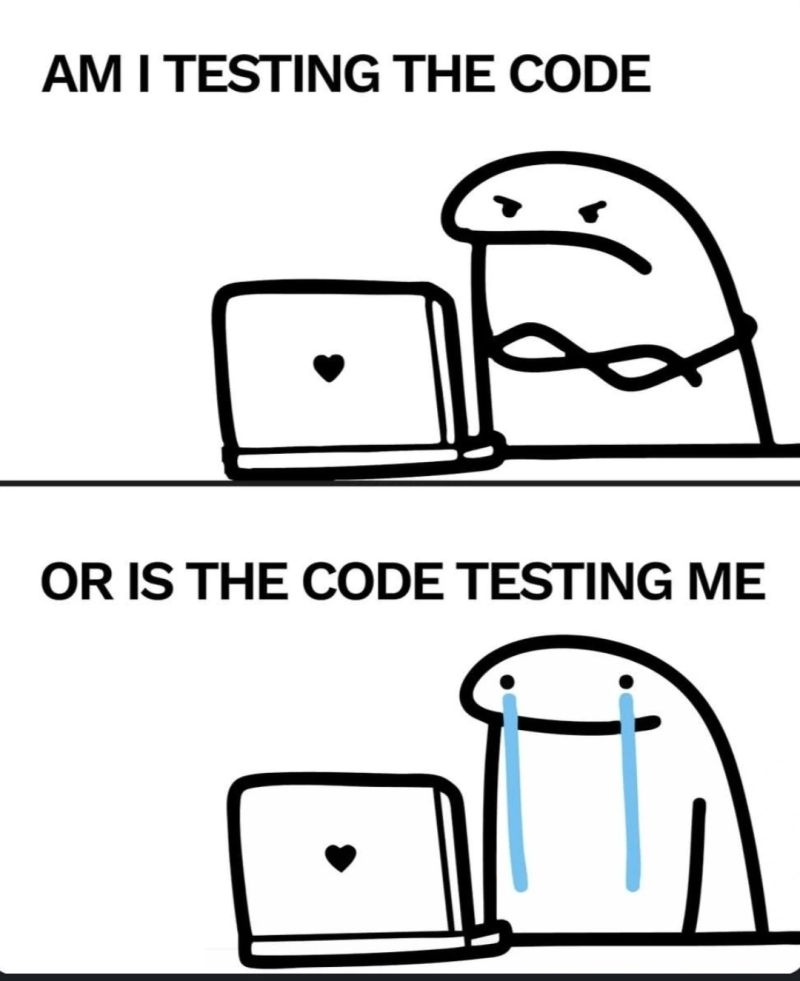

### techBasics1_Sopaluck_Pimpamote
                                                                                                                                                                                                 
# Hi! I'm Sopaluck Pimpamote 👋 🇹🇭/🇳🇴                                                                                                                                                             
 > ### But you can call me *Ohm* :) ###                                                                                                                                                          
>                                                                                                                                                                                                
 > (Like Ohm's Law if you know what that is >.<)                                                                                                                                                 
## 👤 Who am I?                                                                                                                                                                                   
Welcome to my class Github repository for Tech Basics 1!                                                                                                                                                      
                                                                                                                                                                                                 
I am a total beginner in the world of coding, currently figuring out what all these buttons do in my **Tech Basics** class.                                                                      
                                                                                                                                                                                                 
> **Fun fact about me:** I lived on a sheep farm for a year, and ever since then, sheep has become my absolute favorite animal 🐑                                                                 
                                                                                                                                                                                                 
 

## 📊 My Current Stack:                                                                                                                                                                           
* **Languages:** Python (Basic/Beginner), Markdown                                                                                                                                               
* **Tools:** Git, GitHub, VSCode (Basic/Beginner)                                                                                                                                                
* **Operating System:** macOS                                                                                                                                                                    
                                                                                                                                                                                                 
## ☑️ The Mission                                                                                                                                                                                
This repo is basically my digital notebook for class. I'll be using it to:                                                                                                                       
* Learn how **GitHub** works (without breaking anything... hopefully).                                                                                                                           
* Practice **Python** and just learn how to code..                                                                                                                                               
* Figure out why my code works at 2:00 AM but not at 2:00 PM (lol)                                                                                                                               
                                                                                                                                                                                                 
 Buidling on the last point, my ultimate goal for this course is to know what it is I am doing when I code,                                                                                      
 what it means, why it works or why it doesn't work, and then be able to fix that.                                                                                                               
                                                                                                                                                                                                 
___                                                                                                                                                                                              
                                                                                                                                                                                                 
                                                                        # 📂 What's inside....?                                                                                    
If you look into the `assignments` folder, you'll find my latest work :D                                                                                                                         
                                                                                                                                                                                                 
---                                                                                                                                                                                              
                                                                                                                                                                                                 
                              * Thanks for checking out my progress! * 🚀                                                                                                            
